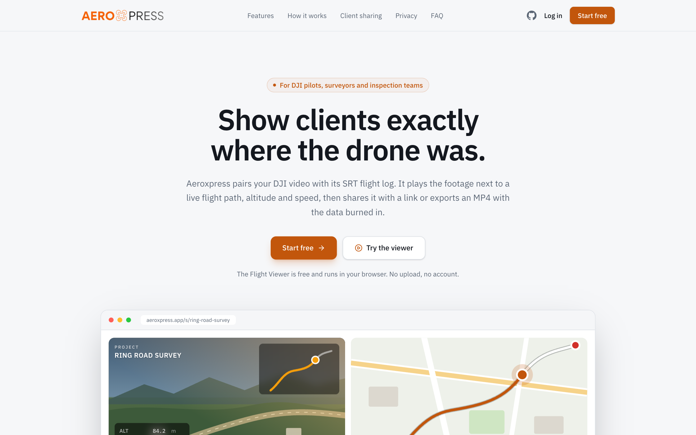
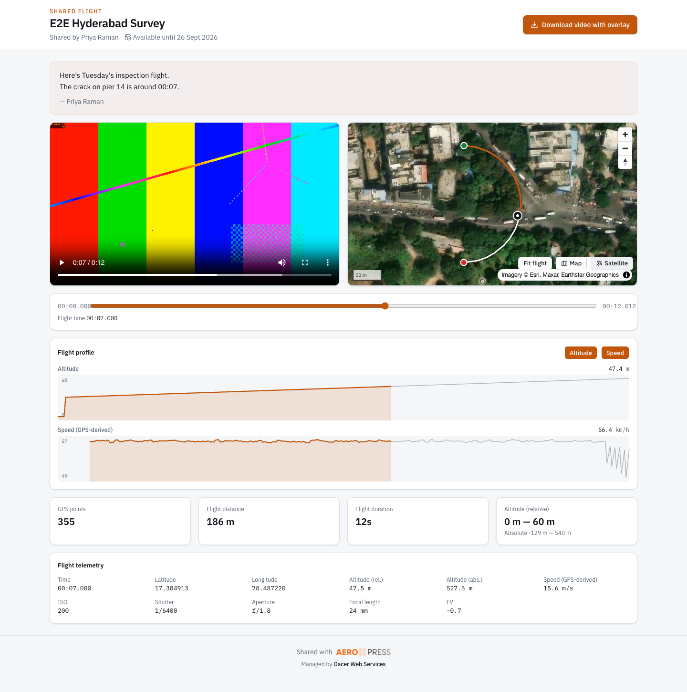
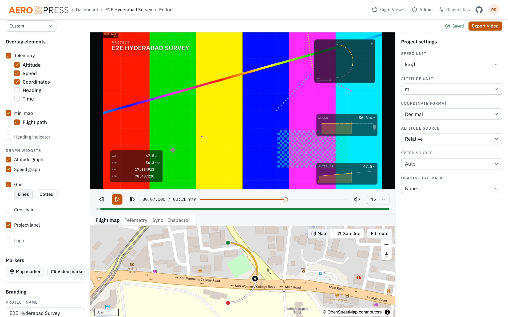
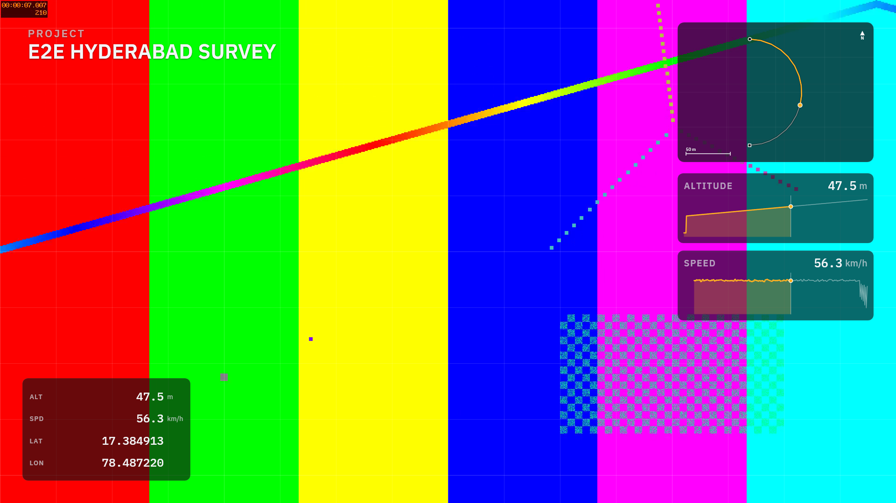
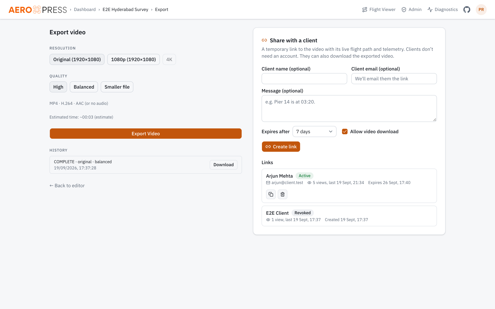
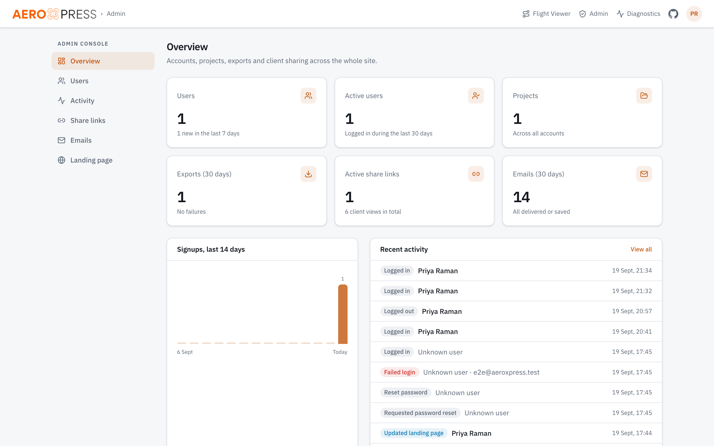
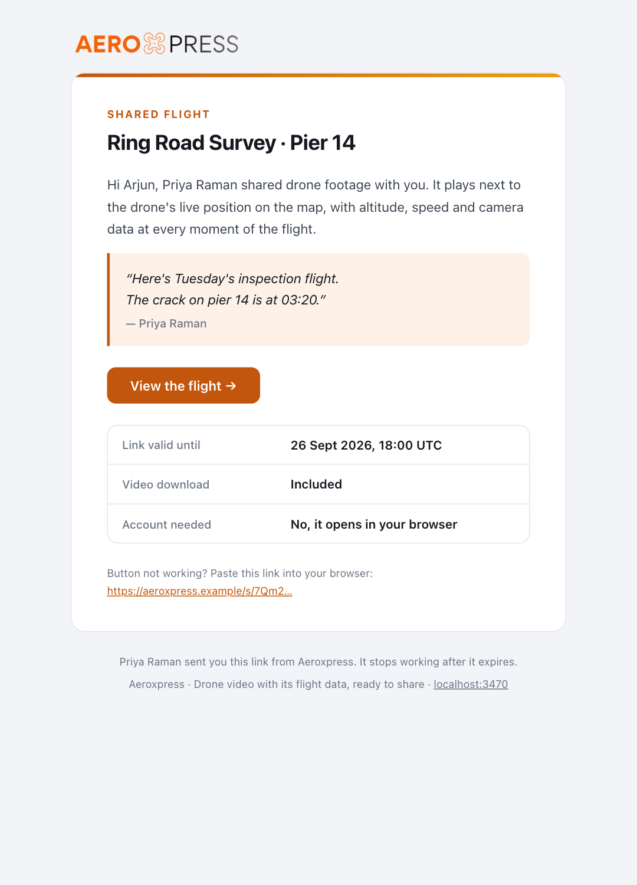

<div align="center">


### Drone video with its flight data, ready to share.

Aeroxpress pairs DJI footage with the SRT flight log the drone records next to it.<br />
It plays the video beside a live flight path, graphs altitude and speed, shares the flight with clients
through temporary links, and exports an MP4 with the telemetry burned in.

[](LICENSE)


[Features](#features) · [Screenshots](#screenshots) · [Quick start](#quick-start) · [Self-hosting](#self-hosting) · [Configuration](#configuration) · [How it works](#how-it-works) · [Contributing](#contributing)



</div>

---

## Why Aeroxpress

Every DJI drone can write an `.SRT` file next to each video: one line of telemetry per frame, with GPS,
altitude, camera settings and a timestamp. Most people never open it. Aeroxpress turns it into something a
client can understand at a glance: **where the drone was, when it was there, and what the camera was doing.**

## Features

|  |  |
|---|---|
| 🗺️ **Flight path, synced to the frame** | Scrub the video and the drone moves on the map. Click the map and the video jumps to that moment. Start, end and the flown track are drawn live. |
| 📈 **Altitude & speed graphs** | Optional graph widgets with a live cursor, in the browser and burned into exported video. |
| 🎬 **Burned-in overlays** | Telemetry panel, mini-map, heading indicator, grid, crosshair, project label, logo, markers and graphs. Drag them into place, preview on the real video, and export an H.264 MP4 with FFmpeg. |
| 🔗 **Temporary client links** | Share a flight at `/s/<token>`: no client account, no dashboard. Links expire in 1–30 days, can be revoked, can include a message, and can optionally offer the exported MP4. You get an email when the client first opens it. |
| 🔒 **Local Flight Viewer** | `/viewer` reads the SRT and plays the video straight from your device. Nothing is uploaded. Drop several files and matching `DJI_0042.MP4` / `DJI_0042.SRT` pairs are grouped automatically. |
| ✉️ **Transactional email** | Branded templates for users, clients and admins: welcome, password reset, export ready, share invite, link opened, new signup, account status. Sent over SMTP, or saved as HTML when no SMTP is set. |
| 🛡️ **Accounts & admin console** | Email + password accounts, per-user project isolation, and an admin console: KPIs, user management, audit log, share links, email log and landing-page copy. |
| 🧭 **Real DJI formats** | Bracket-style logs (Mini, Air, Mavic, Avata), legacy `GPS(…)` logs (Phantom, Inspire), Enterprise logs with gimbal data, and a generic key/value fallback. Invalid, missing and spiking GPS is detected, never plotted. |

## Screenshots

<table>
  <tr>
    <td width="50%"><br /><sub><b>Client share page.</b> Video, satellite flight path, altitude/speed profile and telemetry, no account needed.</sub></td>
    <td width="50%"><br /><sub><b>Overlay editor.</b> Live preview of every widget, driven by the video clock.</sub></td>
  </tr>
  <tr>
    <td><br /><sub><b>Exported frame.</b> Telemetry panel, mini-map and graph widgets burned into the MP4 (synthetic test footage).</sub></td>
    <td><br /><sub><b>Export & share.</b> Export history next to temporary client links.</sub></td>
  </tr>
  <tr>
    <td><br /><sub><b>Admin console.</b> Users, activity, share links, email log and landing-page copy.</sub></td>
    <td><br /><sub><b>Client invite email.</b> One of nine branded templates.</sub></td>
  </tr>
</table>

## Quick start

**Requirements:** Node.js ≥ 22.12 (24 recommended) and FFmpeg/FFprobe ≥ 7.1 with libx264.

```bash
git clone https://github.com/arun2k00/Drone-Flight-Path-Viewer.git
cd Drone-Flight-Path-Viewer
npm ci
cp .env.example .env
npx prisma migrate dev
npm run dev
```

Open <http://localhost:3470> and create an account. **The first account becomes the admin.**

Without SMTP settings, emails are written to `storage/outbox/*.html`, so you can open them in a browser.

<details>
<summary>Installing FFmpeg</summary>

- **macOS:** `brew install ffmpeg`
- **Debian / Ubuntu:** `sudo apt install ffmpeg`
- **Windows:** use WSL2 and install FFmpeg there.

Check with `ffmpeg -version`, or open **Admin → Diagnostics** once the app is running.
</details>

## Self-hosting

Aeroxpress is a long-running Node.js app that runs FFmpeg, stores large uploads and keeps state in SQLite.
It needs a **VPS or a container host with a persistent volume**. Shared PHP hosting and serverless
platforms can't run FFmpeg exports or keep the database.

### Docker (recommended)

```bash
docker compose up --build -d
curl -s http://127.0.0.1:3000/api/health     # {"ok":true}
```

The image (`node:24-trixie-slim`) includes FFmpeg and every native module, runs database migrations on start,
and keeps the database and all media in the `dts-storage` volume. Back that volume up.

**Suggested server:** 2 vCPU and 4 GB RAM (8 GB for 4K exports), plus disk for your footage.

### Production checklist

- [ ] Put it behind HTTPS (Caddy, Nginx or Traefik) and set `APP_URL=https://your-domain`. Session cookies
      become `Secure` and emails link to the right place.
- [ ] Set `SMTP_*` and `MAIL_FROM` so emails are delivered, and `ADMIN_EMAIL` for your admin address.
- [ ] Proxy settings for uploads: `client_max_body_size 64m;` and `proxy_request_buffering off;` in Nginx,
      with generous read timeouts for downloads.
- [ ] Run a single instance: rate limiting and the export queue live in-process.
- [ ] Check the map tile terms for your use (see [Maps](#maps)).

<details>
<summary>Without Docker</summary>

```bash
npm ci
npx prisma migrate deploy
npm run build
npm run start          # port 3470
```
</details>

## Configuration

All settings are environment variables, validated at startup (`src/lib/config/env.server.ts`). Everything
has a working default, so `.env.example` runs as-is locally.

| Variable | Default | Purpose |
|---|---|---|
| `APP_URL` | `http://localhost:3470` | Public URL used in emails and share links. `https://` makes cookies `Secure`. |
| `ADMIN_EMAIL` | empty | Signing up with this address creates an admin. |
| `SMTP_HOST` / `SMTP_PORT` / `SMTP_SECURE` / `SMTP_USER` / `SMTP_PASS` | empty / `587` | Outgoing mail. Empty host → emails saved to `<STORAGE_PATH>/outbox`. |
| `MAIL_FROM` | `Aeroxpress <no-reply@aeroxpress.local>` | Sender address. |
| `DATABASE_URL` | `file:./storage/app.db` | SQLite database. |
| `STORAGE_PATH` | `./storage` | Uploads, derived data, exports, outbox. |
| `TEMP_PATH` | `<os tmpdir>/drone-telemetry` | Export scratch space. |
| `MAX_VIDEO_SIZE_MB` / `MAX_SRT_SIZE_MB` / `MAX_LOGO_SIZE_MB` | `4096` / `50` / `5` | Upload limits. |
| `UPLOAD_CHUNK_SIZE_MB` | `32` | Chunk size for resumable uploads. |
| `FFMPEG_PATH` / `FFPROBE_PATH` | `ffmpeg` / `ffprobe` | Binaries. |
| `NEXT_PUBLIC_MAP_STYLE_URL` | empty → OpenStreetMap raster | Interactive map style. |
| `NEXT_PUBLIC_SATELLITE_STYLE_URL` | empty → Esri World Imagery | Interactive satellite style. |
| `OVERLAY_MAP_TILE_URL` / `OVERLAY_SATELLITE_TILE_URL` (+ `_ATTRIBUTION`) | empty | Basemap tiles burned into exported mini-maps. |
| `MAP_TILE_USER_AGENT` | `Aeroxpress/1.0 (self-hosted)` | User agent for server-side tile requests. |
| `ENABLE_DIAGNOSTICS` | `true` in dev, `false` in prod | `/diagnostics`, FFmpeg logs and the render-parity endpoint (admins only). |
| `LOG_LEVEL` | `info` | `debug` · `info` · `warn` · `error` |

### Maps

Interactive maps use OpenStreetMap (map) and Esri World Imagery (satellite), with attribution shown. Check
each provider's terms for your traffic, or point the `NEXT_PUBLIC_*_STYLE_URL` variables at your own style.
Basemaps inside **exported videos** are off unless you set `OVERLAY_*_TILE_URL` to a provider that allows
server-side rendering into video. Never use `tile.openstreetmap.org` for that.

## How it works

```
 DJI_0042.MP4 ─┐                                   ┌─► Editor preview (canvas, video clock)
               ├─► probe (ffprobe)                 │
 DJI_0042.SRT ─┴─► parse → validate → interpolate ─┼─► Flight Viewer / client share page (browser)
                                                   │
                        overlay config ────────────┴─► Export: static PNG + per-frame RGBA atlas → FFmpeg → MP4
```

- **Telemetry** (`src/lib/telemetry/`): a tokenizer handles BOM, CRLF and UTF-16. Format strategies (bracket,
  inline `GPS(…)`, generic key/value) are detected per file. Field aliases and unit parsing come next, then
  validation: GPS range, no-fix `0,0`, spike filter. Speed and course are derived from GPS when the aircraft
  doesn't log them. Interpolation is circular for heading, so 359° → 1° passes through 0°, not 180°.
- **One renderer, two targets**: the same canvas drawing code renders the live preview in the browser and
  every exported frame on the server (`@napi-rs/canvas`), so what you see is what you export.
- **Export**: static elements are rendered once to a PNG. Dynamic elements are packed into one RGBA strip
  per frame and streamed to FFmpeg over a pipe, then split and overlaid with a filtergraph. Arguments are
  always an argv array, never a shell string.
- **Sharing**: share links resolve through `src/lib/share/service.server.ts`. The share page parses the SRT
  in the browser with the same parser as the local viewer, and streams the video with HTTP Range support.

<details>
<summary>Known DJI SRT limitations</summary>

1. Consumer aircraft (Air 3S, Mini 4 Pro, …) don't log speed, heading or gimbal angles. Speed is derived from
   GPS and labelled as such; heading shows as unavailable.
2. `abs_alt` is often implausible, so relative altitude (height above take-off) is the default.
3. GPS updates less often than video frames; values are interpolated between samples.
4. `0.000000, 0.000000` before GPS lock is treated as "no fix", never as a position.
5. The SRT date line has no timezone; times are shown as recorded by the aircraft.
6. Legacy `GPS(a, b, c)` tuples don't use a consistent order. It's auto-detected when unambiguous and can
   be overridden.
7. Enterprise field names vary by aircraft and firmware; support is best effort.
8. Enable **Video captions** in DJI Fly / Pilot *before* recording. Each MP4 segment has its own SRT.

Inspect any SRT without uploading it: `npm run srt:inspect -- path/to/file.SRT`
</details>

## Security & privacy

- Passwords are hashed with scrypt. Sessions are random 256-bit tokens stored only as SHA-256 hashes and sent
  as `httpOnly`, `SameSite=Lax` cookies.
- Every project, job and upload route checks ownership. Other users' data reads as *not found*.
- Share links are 256-bit random tokens, served with `noindex` and `no-referrer`, and stop working when they
  expire, are revoked, or the owner is suspended.
- Login, signup, password reset and link creation are rate limited. Admin actions are recorded in an audit log.
- All email content is HTML-escaped. FFmpeg never sees user-controlled strings in its filtergraph.
- The local Flight Viewer uploads nothing. Only map tiles are requested from the map provider.

Found a vulnerability? Please open a private security advisory on GitHub rather than a public issue.

## Development

```bash
npm run dev               # http://localhost:3470
npm run verify            # lint + typecheck + unit + integration tests
npm run e2e               # full API walkthrough against a running server (see below)
npm run fixtures          # regenerate synthetic video/SRT test media
```

- **Unit tests** (`tests/unit`) cover the parser, validation, interpolation, overlay layout and rendering,
  FFmpeg argument building, email templates and password hashing.
- **Integration tests** (`tests/integration`) run real FFmpeg exports, the storage provider and share-link
  rules against a throwaway SQLite database.
- **End-to-end** (`scripts/e2e-export.mts`) signs in, uploads a synthetic flight, exports, checks the output
  with ffprobe and pixel diffs, then exercises a client share link through to revocation. It signs in as
  `E2E_EMAIL` (default `e2e@aeroxpress.test`) and creates that account if needed; on an empty database that
  account becomes the admin.

<details>
<summary>Project layout</summary>

```
src/
  app/                 Next.js routes: landing, auth, dashboard, editor, export, viewer, share (/s), admin, API
  components/          UI: editor, overlay stage, map, viewer, share, admin, brand
  lib/
    telemetry/         SRT parsing, validation, interpolation, derived series
    overlay/           overlay model, templates, layout and the shared canvas renderer
    video/             ffprobe, FFmpeg export pipeline, Range streaming
    auth/              sessions, password hashing, rate limiting, server actions
    share/             client share links
    email/             templates and delivery
    admin/, site/      admin actions, landing-page settings
prisma/                schema and migrations (SQLite)
tests/                 unit, integration, fixtures
scripts/               e2e test, fixture generator, SRT inspector
```
</details>

## Contributing

Issues and pull requests are welcome. Before opening a PR:

1. Run `npm run verify` (and `npm run e2e` if you touched uploads, export or sharing).
2. Add a test with your change. For a new SRT format, add a fixture in `tests/fixtures/srt/` and a case in
   `tests/unit/telemetry/parser.test.ts`.
3. Keep PRs focused, one change per PR.

## License & credits

Aeroxpress is released under the [MIT License](LICENSE).

- IBM Plex Sans & Mono: SIL Open Font License 1.1 (`public/fonts/`).
- MapLibre GL JS: BSD-3-Clause. Map data © OpenStreetMap contributors (ODbL). Imagery © Esri, Maxar,
  Earthstar Geographics.
- DJI is a trademark of SZ DJI Technology Co., Ltd. Aeroxpress is not affiliated with or endorsed by DJI.

<div align="center">
<br />
<sub>Managed by <a href="https://oacer.com"><b>Oacer Web Services</b></a></sub>
</div>
